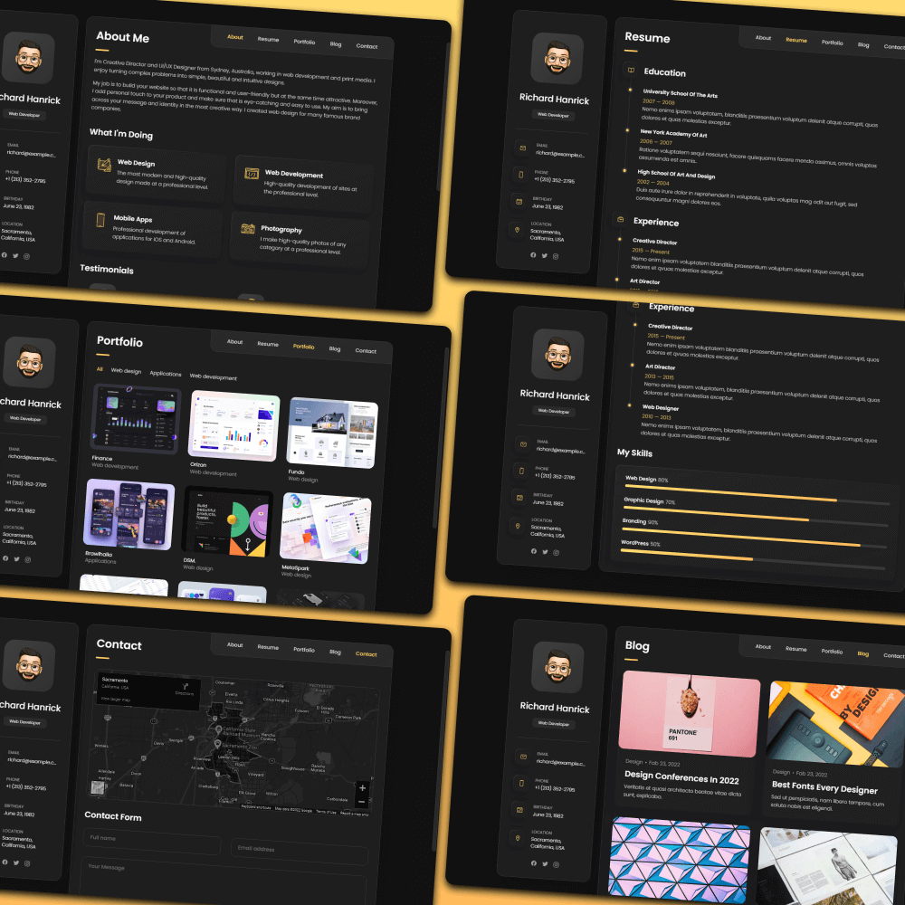

## vCard--Personal-portfolio

This is a personal portfolio website template that can be used to showcase your work and projects. It is designed using HTML, CSS, and JavaScript. You can easily customize the template to make it your own.



## Prerequisites

Before you begin, ensure you have met the following requirements:

- Git must be installed on your operating system.

## Installing vCard--Personal-portfolio

To install vCard, follow these steps:

Linux and macOS:

```bash
sudo git clone https://github.com/Bryan-Giitwa/vCard--Personal-portfolio.git
```

Windows:

```bash
 git clone https://github.com/Bryan-Giitwa/vCard--Personal-portfolio.git
```

## vCard--Personal-portfolio

To use vCard, follow these steps:

```bash
cd vCard--Personal-portfolio
```
